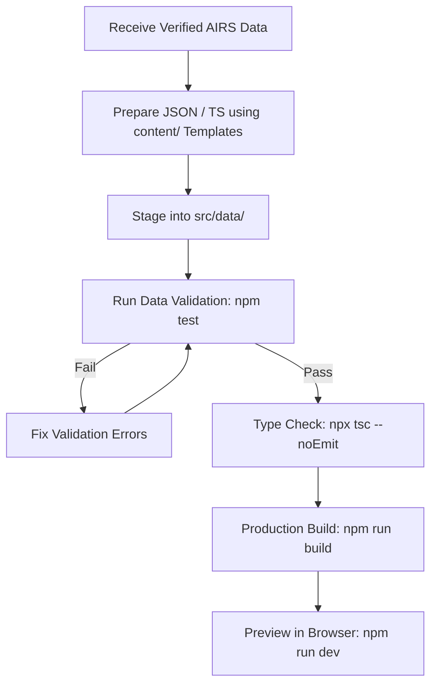

# AIRS City — Content Ingestion Pipeline

This directory provides submission templates, schema definitions, and workflow guidelines for ingesting official AIRS data into **AIRS City**.

---

## 1. Pipeline Principles

1. **Architecture Freeze**: The frontend, camera, GSAP animations, Web Audio engine, and styling are locked. Content updates must **only** touch data files.
2. **Zero Fabrication**: Never invent names, bios, project outcomes, future dates, or social URLs. Intentional empty states (`DATA PENDING`, `NO VERIFIED ENTRIES`) are preferred over synthetic placeholders.
3. **TypeScript Authority**: All records must adhere to the strongly-typed interfaces in `src/data/` and pass automated validation rules in `src/data/validate.ts`.

---

## 2. Ingestion Workflow



1. **Receive Official Data**: Collect verified rosters, approved bios, build logs, and confirmed events from official AIRS leads.
2. **Format Data**: Use the corresponding folder template:
   - `content/crew/` $\rightarrow$ Staffing, Board of Directors, and 7 team rosters
   - `content/projects/` $\rightarrow$ Student engineering builds & case studies
   - `content/research/` $\rightarrow$ Research labs, papers, and opportunities
   - `content/events/` $\rightarrow$ Hackathons, workshops, and gatherings
   - `content/links/` $\rightarrow$ Official organization URLs
3. **Stage Data**: Place formatted records into the respective `src/data/*.ts` file.
4. **Validate**: Run `npm test` to trigger automated validation rules (catches duplicate IDs, bad URLs, invalid team names, hierarchy mismatches).
5. **Compile**: Run `npx tsc --noEmit` to verify type safety.
6. **Build**: Run `npm run build` to verify production bundling.

---

## 3. Pillar Inventory & Target Files

| Pillar | Target Data File | Template Guide | Current State |
| :--- | :--- | :--- | :--- |
| **Crew** | `src/data/crew.ts` | [crew/README.md](./crew/README.md) | 25 roles configured; personnel pending |
| **Projects** | `src/data/projects.ts` | [projects/README.md](./projects/README.md) | Empty (awaiting real student submissions) |
| **Research** | `src/data/research.ts` | [research/README.md](./research/README.md) | 5 exploratory domains; labs pending |
| **Events** | `src/data/events.ts` | [events/README.md](./events/README.md) | Empty (awaiting official schedule) |
| **Links** | `src/data/links.ts` | [links/README.md](./links/README.md) | 5 platforms classified (unverified pending URL) |

---

## 4. Verification Metadata

Where appropriate, records may include verification metadata for audit trails:
```typescript
{
  verified: true,
  verificationSource: "Approved 2026-2027 Executive Roster Submission",
  verifiedAt: "2026-09-23"
}
```
*Note: Verification metadata is maintained for internal repository integrity and is not rendered directly in user-facing UI.*
